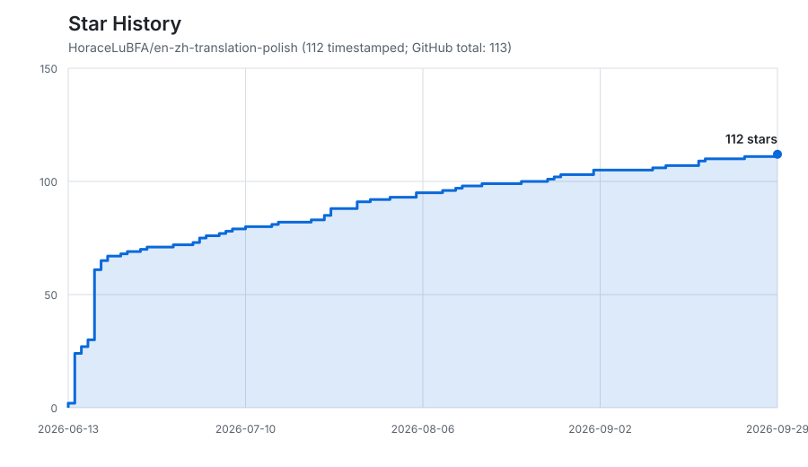

<div align="center">

# en-zh-translation-polish · 英译汉翻译润色

### 忠实传达原文，译成自然中文，支持逐段英中对照

[](./LICENSE)
[](./SKILL.md)
[](https://github.com/vercel-labs/skills)

**[English](./README.en.md) | 中文**

</div>

---

## 翻译理念

本 skill 将叶子南《高级英汉翻译理论与实践》（第4版）的英译汉方法组织为可执行的翻译与润色流程：先完整、准确地传达原文，再消除翻译腔，让中文读者读到自然、流畅的译文。

- **忠实性优先**：保留事实、逻辑、限定条件、说话者归属与语气强度，归化自由度只调整表达方式。
- **按文本调节表达**：法律、科技与合同克制调整；散文、评论等可灵活处理句法与修辞。采访和行业综述按段落或信息功能判断。
- **发挥汉语意合之长**：拆解长句、精简冗余连接词、调整被动句与长定语，同时保留原文关系。
- **兼顾音韵节奏**：适度使用双音节、四字结构与对偶，保留原文修辞的作用，以自然为度。

本 skill 以文本定档、意义理解、中文重构、润色诊断、准确质检和标点规范支持翻译。按文本类型选择相关检查；短文本无需展示完整诊断过程或通读全部参考表，准确性与保真要求继续适用。

## 适用场景

- **消除机翻与直译的翻译腔**——形合迁移、的的不休、抽象名词作主语、被动滥用、习语硬译等顽疾，逐条识别并修正；
- **统一改稿标准**——三张可查证的参考表，把“改哪里、怎么改、改到多狠”固定为可复用的判据；
- **维护中英对照**——以对照文件为单一真源，全中文版由脚本派生，两版始终一致；
- **核对译文完整性**：逐段双向检查遗漏、无依据增写、限定条件与归属，长文分批翻译和核查。
- **规范中文标点**：按中文标点规则归一并检查残留，英文原文与链接等内容按约定保留。

## 润色边界

方法服务于译文。归化与润色遵循以下边界：

- **归化有度**——保留原文应有的风格、术语精度与文化标记；西化是一个连续体，硬文本与永久价值文本能容纳更多异化；
- **辞藻克制**——音韵节奏只是手段，四字结构适可而止；
- 拿不准“改到多狠”时，回到阶段 0 的档位：自由度越低，越克制。

所有档位均须完整、准确地传达原意。外部知识可帮助消歧，不能补写成原文的陈述；原文已有的比喻、夸张与个人语气保留其作用，不额外强化。用户明确要求摘要、节译或改写时，按指定范围交付并说明处理方式。

## 工作流

下表说明完整工作流。短段落可直接在聊天中交付；全文或项目翻译沿用文件交付契约。用户已指定纯译文、双语或目标文件时按其要求执行，无需重复确认。

| 阶段 | 名称 | 做什么 |
|---|---|---|
| 0 | 文本分析定档 | 判定文本类型与表达自由度 1–10，混合文本按段落或信息功能判断 |
| 1 | 脱离语言外壳 | 理清事实、指代、否定、条件与语气，摆脱英文句法组织中文 |
| 2 | 按档位初译 | 意合优先：拆长句、精简冗余连接词、调整被动句与长定语 |
| 3 | 润色诊断 | 逐段过三张表：翻译腔病症 ／ 技巧库 ／ 隐喻决策 |
| 4 | 音韵节奏打磨 | 双音节／四字／对偶；软文本放开，硬文本点到为止 |
| 5 | 准确性质检 | 从原文检查信息覆盖，再回查译文依据；核对逻辑、归属、术语与语气 |
| 6 | 中文标点规范化 | 脚本机械归一全角标点，自检残留为 0 |
| 7 | 输出英中对照 | 逐段配对，附一句“档位判定 + 主要润色取舍” |

长文、多受访者或图文穿插文本按原有结构分批处理，合并后核对顺序、缺段和术语一致性。英文引用、段落数量和标点检查均不能替代语义核查。

支撑工作流的三张参考表（位于 `reference/`，均带原文引用与英汉译例）：

- **`text-analysis-and-qa.md`**——文本定档（7 维度 → 自由度、纽马克 XYZ 系数、软硬总开关）、隐喻翻译决策、准确性质检清单；
- **`translationese-symptoms.md`**——9 类翻译腔病症的识别信号与修法、音韵节奏规则、西化可接受度边界；
- **`techniques.md`**——14 个可操作技巧（解包袱法、词性转换、增／减词、分句／合句、语序移位、定语从句转化、正反译、被动转化）。

## 安装

**方式一 · 一行命令（推荐）**

```bash
npx skills add -g HoraceLuBFA/en-zh-translation-polish
```

> [`npx skills`](https://github.com/vercel-labs/skills) 按所选 agent 配置技能入口。安装后应在实际使用的宿主技能列表中确认可用。

**方式二 · 交给 agent 安装**

把仓库链接发给你的编码 agent（Claude Code / Codex / Gemini CLI 等），一句"帮我安装这个 skill"即可：

> 帮我安装这个 skill：https://github.com/HoraceLuBFA/en-zh-translation-polish

**方式三 · 手动 clone**

```bash
git clone https://github.com/HoraceLuBFA/en-zh-translation-polish.git ~/.agents/skills/en-zh-translation-polish
```

安装后验证：

```bash
test -f ~/.agents/skills/en-zh-translation-polish/SKILL.md && echo OK
```

## 使用方式

**自然语言**——直接提出需求即可，支持自动触发的 agent 会据 `SKILL.md` 的 `description` 字段加载本 skill。常见说法：

- “把这段英文翻译成中文，要地道一点：……”
- “翻译这篇英文短文，我要中英对照的版本。”
- “请帮我翻译这段技术说明／新闻稿／小说片段。”

本技能用于英文文本翻译，以及对照英文原文润色已有中文译稿。本技能可独立安装使用，无需额外安装其他翻译技能。输入为 PDF 或其他文档时，先使用当前宿主可用的读取工具获取原文；保留用户要求的正文、图表说明、公式、引文和参考文献。无法可靠提取的内容应说明缺口，不将翻译任务转交给用户未安装的技能。

**命令显式调用**——直接点名本 skill，把文件或文本作为参数传入：

```text
# Claude Code：斜杠命令
/en-zh-translation-polish path/to/article.md

# Codex：用 $ 显式调用（或先 /skills 从列表选择）
$en-zh-translation-polish path/to/article.md
```

> ⚠️ **想要纯中文输出**：本 skill **默认产出英中对照**。若只要中文译文，请在 prompt 里显式强调，例如“只要中文，不要英文对照”“仅输出译文”——否则会默认给对照版。

## 交付物

以下为全文或项目翻译的默认文件交付。聊天短段落直接回复；用户明确指定的单语、双语或文件形式优先。

1. **`<名称> 翻译(中英对照).md`**——单一真源：每段英文原文作为 blockquote，其下紧接中文译文；
2. **`<名称> 翻译(全中文).md`**（按需）——由脚本从对照文件派生；
3. 一段简短说明——交代本篇的档位判定与主要润色取舍。

## 输出预览

> The confidence that the West would remain a dominant force in the 21st century is giving way to a sense of foreboding.

西方曾笃信自己将在 21 世纪稳居主导地位，如今这份自信，正让位于一种隐隐的不祥之感。

*（阶段 0 判定：偏硬／政论，自由度≈3，准确优先、克制音韵。）*

## 姊妹 skill

反方向（中→英）请用 **[zh-en-translation-polish](https://github.com/HoraceLuBFA/zh-en-translation-polish)**——蒸馏自 Joan Pinkham《中式英语之鉴》与陆国强《汉译英常用表达式经典惯例》，把中文译成地道、无中式英语的英文，并产出汉英对照。两个 skill 结构对称、互为镜像，各管一个方向。

## 仓库结构

```text
en-zh-translation-polish/
├── SKILL.md                       # 主入口（工作流 + 标点归一脚本）
├── README.md                      # 项目说明（面向人）
├── reference/
│   ├── text-analysis-and-qa.md    # 文本定档 + 隐喻 + 准确性质检
│   ├── translationese-symptoms.md # 翻译腔病症 + 音韵 + 西化边界
│   └── techniques.md              # 14 个可操作技巧
├── test-prompts.json              # 触发／诱饵／边界与翻译质量用例
├── LICENSE
└── .gitignore
```

## 致谢与许可

本 skill 的代码、提示词与组织方式以 **MIT 许可**发布，可自由使用、修改、再分发，详见 [LICENSE](./LICENSE)。

方法论与判例蒸馏、转述自 **叶子南《高级英汉翻译理论与实践》（第4版，清华大学出版社，2020）**，在此谨致谢忱。`reference/` 中的少量引文系评注与教学目的的简短摘引，著作权归原作者与出版社所有；本 skill 仅为方法工具，不能替代原著，建议系统学习者购买正版。

本 skill 借助 [cangjie-skill](https://github.com/kangarooking/cangjie-skill)（将书籍方法论蒸馏为可调用 AI skill 的开源拆书流水线）生成，一并致谢。

## Star History

[](https://github.com/HoraceLuBFA/en-zh-translation-polish/stargazers)

## 版本与更新

当前版本：[v1.1.1](https://github.com/HoraceLuBFA/en-zh-translation-polish/releases/tag/v1.1.1)。发布说明与历史版本见 [Releases](https://github.com/HoraceLuBFA/en-zh-translation-polish/releases)，详细变更见 [CHANGELOG.md](./CHANGELOG.md)。
